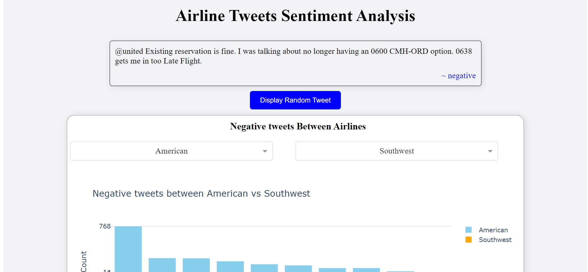

# Tweet Sentiment Analysis Project

## Project Overview
This project focuses on analyzing tweets to determine sentiment—positive, neutral, or negative—using advanced natural language processing techniques. We utilized BERT and VADER models for sentiment classification and explored tweet data from various airlines across different locations over time. The project includes a Dash application for interactive visualization and analysis of insights.

## Data Cleaning and Preparation
- **Data Collection:** Compiled a comprehensive dataset of tweets related to various airlines.
- **Preprocessing:** Conducted extensive text preprocessing including tokenization, stopwords removal, and lemmatization.
- **Missing Data Handling:** Addressed missing data through imputation or exclusion of unusable entries.
- **Feature Engineering:** Generated additional features like sentiment scores and timestamps for enhanced analysis.

## Exploratory Data Analysis
A thorough EDA was performed to uncover key patterns and relationships:
- **Sentiment Distribution:** Analyzed the distribution of positive, neutral, and negative sentiments.
- **Airline Comparison:** Compared sentiment distributions across different airlines.
- **Geographical Analysis:** Mapped sentiment distribution across various locations.
- **Time-Series Analysis:** Examined sentiment trends over different time periods.

## Modeling
Multiple models were used for sentiment classification:
- **BERT (Bidirectional Encoder Representations from Transformers):** Primary model known for state-of-the-art NLP performance.
- **VADER (Valence Aware Dictionary and sEntiment Reasoner):** Used for comparative analysis due to its effectiveness in social media sentiment analysis.

## Model Tuning
The BERT model underwent rigorous hyperparameter tuning:
- Techniques included grid search and cross-validation to optimize prediction accuracy and stability.

## Dash Application
- Developed a Dash application for visualizing and interacting with sentiment analysis results.
- **Features:**
  - **Interactive Visualizations:** Explore sentiment trends, airline comparisons, and geographical distribution using interactive charts and maps.
  - **Real-Time Analysis:** Input and analyze tweets in real time for instant sentiment predictions.
  - **Airline Insights:** Detailed sentiment analysis for specific airlines over time and location.

## Application Features
- **Sentiment Analysis:** Input tweet data to receive instant sentiment classification.
- **Visualization Tools:** Use interactive tools to explore data trends and insights.
- **User-Friendly Interface:** Intuitive design for easy navigation and interaction.

## Screenshots

  
## Project Demonstration GIF
Here's a GIF illustrating how the Dash application works:
