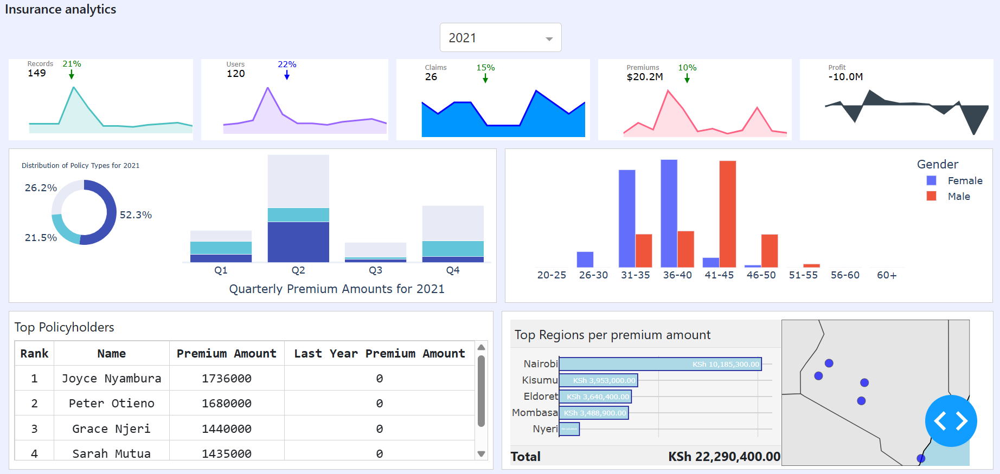

# Insurance Analytics Dashboard

This project presents an interactive dashboard for an insurance company, covering multiple insurance types including health, home, and vehicle insurance. The dashboard provides insights into policy data, claims, premiums, customer demographics, and agent performance.

## Database Schema

The database consists of several interconnected tables:

- **policy_information**: Central table containing core policy details.
- **policyholder_info**: Customer demographic information.
- **health**: Health insurance-specific data.
- **home**: Home insurance details.
- **vehicle**: Vehicle insurance information.
- **claims**: Claim records across all insurance types.
- **agents**: Insurance agent information.

### Key Relationships:

- `policy_information` is linked to `policyholder_info`, `health`, `home`, and `vehicle` tables via `Policy_ID`.
- The `claims` table is connected to `policy_information` through `Policy_ID`.
- The `agents` table is related to `policy_information` via `Agent_ID`.

## Main Page Features

1. **Policy Transaction Insights**
   The first section of the dashboard displays five key charts, each representing different policy-related metrics:
   - **Count of Each Policy Transaction**: Line plot showing the monthly number of transactions across all policy types.
   - **Number of Users**: Line plot displaying the monthly growth or decline in users.
   - **Number of Claims**: Line plot tracking monthly claims data, showing increases or decreases over time.
   - **Total Premiums Sum**: Line plot showing the monthly total of premiums collected and their fluctuations.
   - **Profit**: Line plot visualizing monthly profit trends, displaying increases and decreases.

   All five line plots share the same line style, ensuring a consistent visual experience.

2. **Distribution of Policy Types and Stacked Premiums by Quarter**
   The second section includes two main visualizations:
   - **Policy Type Distribution**: Chart displaying the distribution of policy types (Health, Motor Vehicle, and Home Insurance), allowing for comparison between them.
   - **Stacked Premium Amounts by Quarter**: Stacked bar chart breaking down premium amounts for each insurance type across Quarter 1 to Quarter 4 (Q1 to Q4).

   This section also includes premium data by gender and age, providing additional demographic insights.

3. **Top Policyholders and Regional Premium Analysis**
   The third section consists of two tables and a map visualization:
   - **Top 5 Policyholders (Table)**: Lists the top five policyholders based on their premium amounts.
   - **Top 5 Regions (Table)**: Displays the top five regions with the highest premium amounts.
   - **Map Visualization**: A map plot visually representing the premium amounts across the top five regions, with markers indicating relative premium sizes.

4. **Dynamic Year-Based Analysis**
   The dashboard includes a dynamic year filter. Users can select a specific year, and all data—policy transactions, claims, premiums, and profit trends—will update to reflect the chosen time period.

   This interactive functionality provides a comprehensive view of policy trends, customer demographics, and financial performance across different insurance types and years, enabling data-driven decision-making.

   

## Home Insurance Analytics

The Home Insurance dashboard offers an overview of key metrics and trends based on available data:

- A map visualization displays the geographic distribution of insured properties. Larger circles on the map indicate areas with a higher concentration of policies.
- Insights include the total number of insured properties, overall property values insured, and claims data.
- The dashboard also highlights the number of towns covered by the insurance company and the percentage increase in policies or claims over a given period.
- Users can interact with the dashboard by selecting towns from a dropdown menu to explore specific data for each location. An integrated AI analyzer provides deeper insights into trends, claims, and other relevant information for the selected region.

## Health Insurance Analytics

This section highlights key health insurance metrics and trends based on data for the selected year:

- **Top Medical Conditions by Treatment Cost**: The dashboard ranks the top medical conditions that incurred the highest treatment costs, providing insight into the most significant health-related expenses.
- **Additional Metrics**: The data includes the total number of users, health transactions, and the number of medical conditions covered. It also shows the total treatment costs incurred during the year.

The dashboard updates dynamically based on the selected year, allowing users to explore how treatment costs, medical conditions, and other health-related metrics fluctuate over time. An integrated AI-powered Q&A system enables users to interact with the health insurance dataset, answering specific questions and providing deeper insights into the health dataset.

## Vehicle Insurance Analytics

This section provides an overview of vehicle insurance data, dynamically updating based on the selected year:

- **Top Car Sales**: The dashboard highlights the total value of car sales for various makes and models, giving insight into the most popular and high-value vehicles.
- **Top Claims by Make**: The top vehicle makes are ranked based on the number of insurance claims filed, offering a view of claim trends by brand.
- **Car Sales by Make and Model**: The dashboard breaks down the sales figures by car make and model, showing which vehicles contributed the most to overall sales.
- **Monthly Premiums by Car Make**: Users can explore the monthly premium trends for different car makes, with visualizations that compare premium amounts for vehicles like Toyota, Mercedes, Audi, Nissan, and more.

This section includes a visualization of premium amounts for select car makes, showing how these amounts fluctuate over time.

## Agent Performance Analytics

This section focuses on analyzing agent performance based on dynamically selected years and data, providing insights into top agents, commission trends, and policy contributions.

- **Top Agents**: The dashboard highlights the top-performing agents, showcasing their commissions and locations. Users can filter by year to see how agents performed in different periods.
- **Commission Trends**: The dashboard provides insights into commission growth, identifying the years with the highest overall commissions and comparing year-over-year increases.
- **Top-Performing Policy Types**: Users can explore which policy types contributed the most to agent commissions, with health, home, and motor vehicle insurance being key categories.

The dashboard includes tables and visualizations that highlight:
- **Top Performers**: The top agents are ranked based on their commission earnings.
- **Commission Growth**: Year-over-year changes in total commissions are displayed to showcase performance trends.
- **Top Agents by Policy Type**: Insights into which agents earned the most from specific insurance categories, such as health, home, and motor vehicle insurance.

This section offers a detailed overview of agent performance, helping to identify high achievers, benchmark performance, and guide management strategies based on the data trends.

## Project Demonstration

Check out the live demo of the project below:

You can also access the project [here](https://kenyaninsurance.pythonanywhere.com/).
