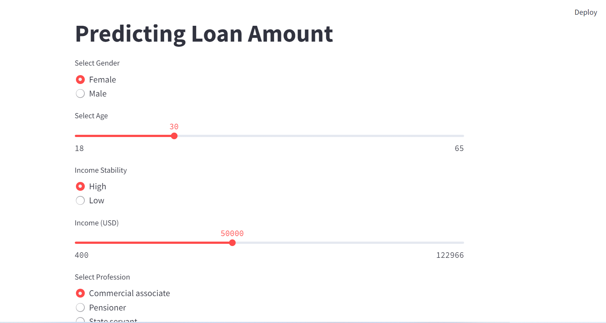

## Project Overview
This project predicts the loan amount a user can receive based on various features such as income, credit score, employment history, and more. We used a robust dataset with over 30,000 entries and applied extensive preprocessing techniques to ensure the model's accuracy. The best-performing model, a tuned Random Forest, is deployed in a Streamlit application for easy access and use.

## Data Cleaning and Preparation
- **Missing Values:** Imputed missing values using appropriate statistical methods.
- **Outlier Replacement:** Replaced outliers with values within a defined range to reduce their impact.
- **Feature Engineering:** Created new features and transformed existing ones to improve model performance.

## Exploratory Data Analysis
We conducted extensive exploratory data analysis (EDA) to understand the distribution and relationships of the features:
- **Correlation Plot:** Identified the relationships between features and the target variable.
- **Univariate Analysis:** Examined individual feature distributions.
- **Bivariate Analysis:** Explored relationships between pairs of features.

## Modeling
Several machine learning algorithms were tested to find the best fit for our data:
- **Linear Regression**
- **Decision Tree**
- **Random Forest**
- **Support Vector Machine**
- **Gradient Boosting**

Random Forest was selected as the best model due to its superior performance.

## Model Tuning
The Random Forest model was tuned using techniques such as grid search and cross-validation to optimize hyperparameters. This resulted in improved prediction accuracy and model robustness.

## Streamlit Application
We developed a Streamlit application to provide a user-friendly interface for predicting loan amounts based on the selected features. The application allows users to input their data and get instant loan amount predictions.

