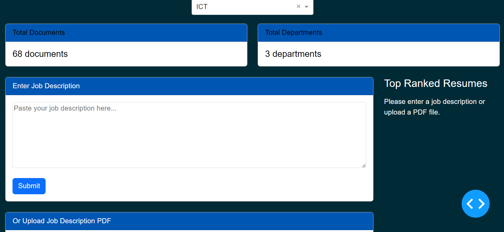
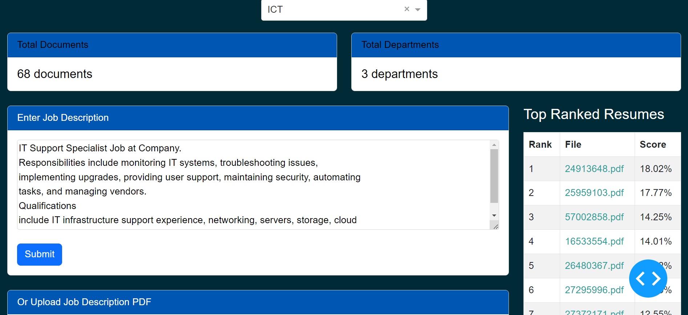
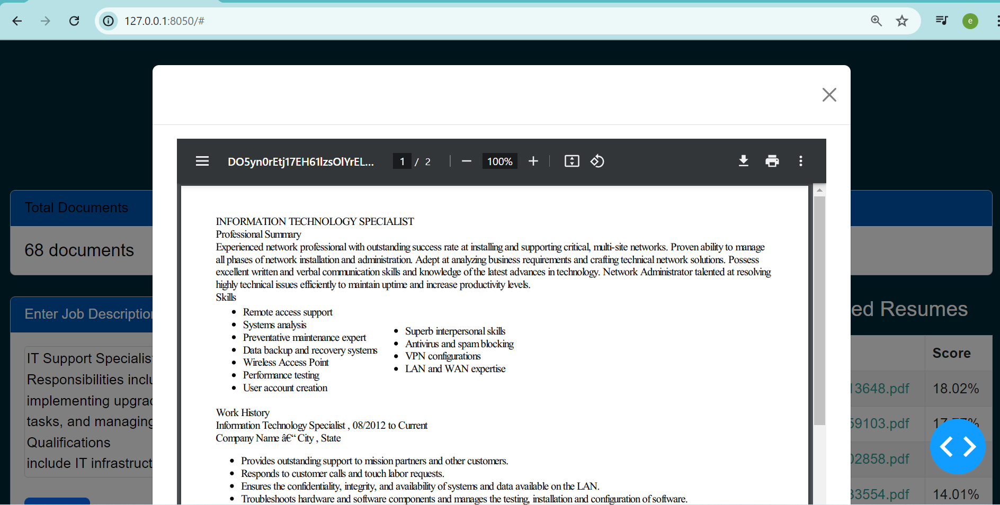

# Resume Ranking Application

## Introduction
This project is designed to rank resumes based on a given job description. Users can either paste a job description or upload a PDF file, and the application will process and rank the resumes accordingly. This tool is particularly useful for HR departments and recruiters looking to streamline the resume screening process.

## Installation

### Prerequisites
Before you begin, ensure you have met the following requirements:
- You have installed Python 3.x
- You have a functioning internet connection

### Setup
1. **Clone the Repository**
    ```sh
    git clone https://github.com/yourusername/resume-ranking-app.git
    cd resume-ranking-app
    ```

2. **Create a Virtual Environment**
    It’s a good practice to create a virtual environment for your project. Run the following commands:
    ```sh
    python -m venv venv
    source venv/bin/activate  # On Windows, use `venv\Scripts\activate`
    ```

3. **Install Dependencies**
    Install the required Python packages using pip:
    ```sh
    pip install -r requirements.txt
    ```

## Usage
Here’s how to use the Resume Ranking Application:

1. **Start the Application**
    To start the application, run:
    ```sh
    python app.py
    ```

2. **Access the Application**
    Open your web browser and go to `http://127.0.0.1:8050/`.

3. **Upload Job Description**
    You can either paste the job description in the provided text area or upload a PDF file with the job description. Click on the 'Submit' button to proceed.

    

4. **View Ranked Resumes**
    The application will display the ranked resumes based on the provided job description. The resumes are listed in descending order of their relevance score.

    

5. **View Resume Details**
    Click on any resume to view the detailed content. A PDF viewer will pop up displaying the selected resume.

    

## Features
- **Job Description Input**: Enter job descriptions manually or upload as PDFs.
- **Resume Ranking**: Ranks resumes based on relevance to the job description.
- **PDF Viewer**: View the detailed resume directly in the application.

## License
This project is licensed under the MIT License. See the [LICENSE](LICENSE) file for details.
