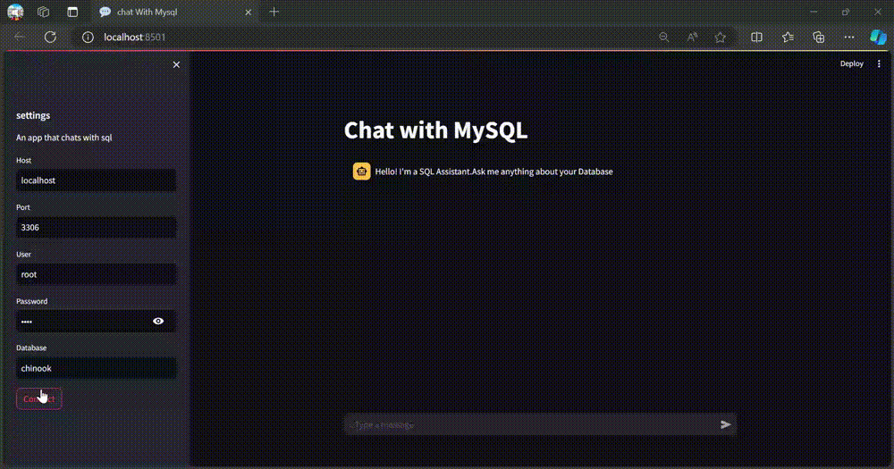

# Chat with MySQL
## Overview
"Chat with MySQL" is a Streamlit application designed to provide a conversational interface for querying a MySQL database. Leveraging LangChain and Cohere's language models, this application allows users to interact with a database through natural language questions, which are converted into SQL queries and executed to retrieve relevant information.

## Features
- **Natural Language Interaction**: Users can ask questions about the database, and the app will convert these questions into SQL queries.
- **Dynamic SQL Query Generation**: Based on the schema and conversation history, SQL queries are dynamically generated to answer user queries.
- **Schema Awareness**: The application understands the database schema and uses it to craft accurate SQL queries.
- **Conversation History**: Maintains chat history to provide context for SQL queries and responses.

## Technologies Used
- **Streamlit**: For building the interactive web interface.
- **LangChain**: For managing conversation history and generating SQL queries.
- **Cohere**: For natural language processing to convert SQL results into human-readable responses.
- **MySQL**: As the database management system.
- **dotenv**: For managing environment variables.

## Project Demonstration

