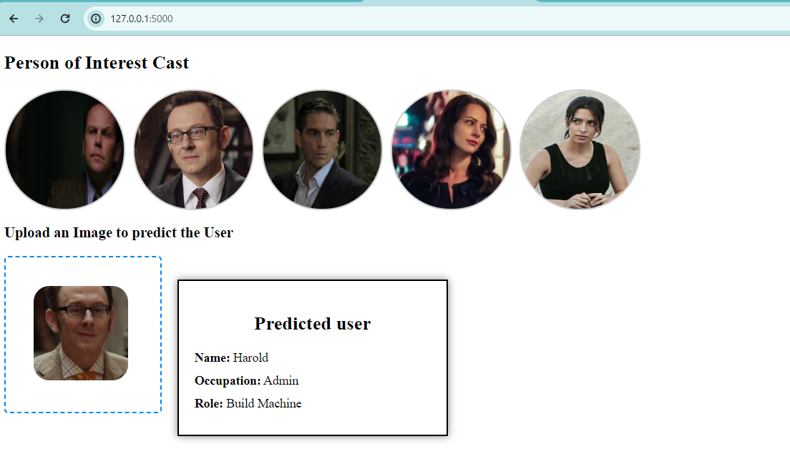

# Person of Interest Cast Prediction

## Introduction
This project is designed to predict which character from the TV show "Person of Interest" is displayed in an image dropped into the dropzone. The prediction is based on a model created using OpenCV. We utilized frontal face and eye cascade classifiers to identify faces in images. The model's accuracy was tested and evaluated, showing promising results. Images containing two visible eyes and faces were cropped and saved into a folder, which was then used for training the model. Feature engineering was performed using wavelet transforms.

## Installation

### Prerequisites
Before you begin, ensure you have met the following requirements:
- You have installed Python 3.x
- You have a functioning internet connection

### Setup
1. **Clone the Repository**
    ```sh
    git clone https://github.com/yourusername/person-of-interest-cast-prediction.git
    cd person-of-interest-cast-prediction
    ```

2. **Create a Virtual Environment**
    It’s a good practice to create a virtual environment for your project. Run the following commands:
    ```sh
    python -m venv venv
    source venv/bin/activate  # On Windows, use `venv\Scripts\activate`
    ```

3. **Install Dependencies**
    Install the required Python packages using pip:
    ```sh
    pip install -r requirements.txt
    ```

### Data Preparation
1. **Download the Dataset**
   Ensure you have the dataset with images of the characters from "Person of Interest". If the dataset is not included in the repository, you can download it from the provided source or manually collect images.

2. **Organize the Dataset**


## Usage
Here’s how to use the Person of Interest Cast Prediction tool:

1. **Training the Model**
    To train the model with your dataset, run:
    ```sh
    python train_model.py
    ```

2. **Making Predictions**
    To make predictions on new images, run:
    ```sh
    python predict.py --image_path path/to/your/image.jpg
    ```

## Features
- Predicts the character from "Person of Interest" displayed in an image
- Uses OpenCV for face and eye detection
- Implements wavelet transforms for feature engineering

## Example


## License
This project is licensed under the MIT License. See the [LICENSE](LICENSE) file for details.
